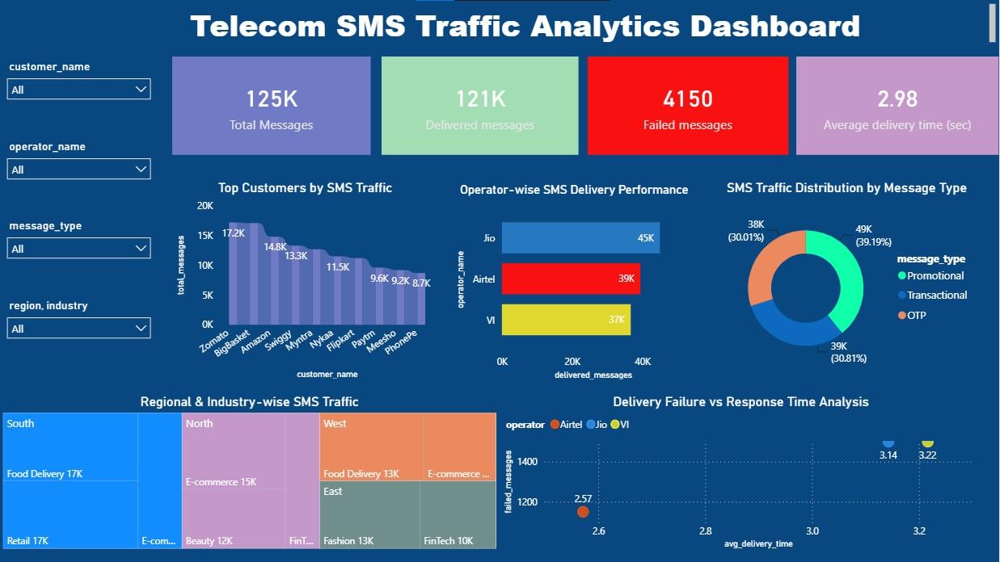

# Telecom SMS Traffic Analysis

## Project Overview

This project presents an end-to-end **Telecom SMS Traffic Analytics Dashboard**
built using **Power BI, SQL, and Excel** to analyze bulk SMS traffic data
across multiple industries, telecom operators, and regions in India.

The goal of this project is to understand SMS delivery performance, identify
top-sending customers, evaluate operator efficiency, and uncover regional
and industry-wise messaging trends through interactive visualizations.

---

## Objectives

- Analyzed SMS traffic volume across 10 major Indian brands
  to identify top-performing customers by message count
- Evaluated telecom operator performance based on delivery
  success rates, total delivered messages, and average
  delivery time
- Investigated regional SMS traffic distribution across
  North, South, East, and West zones
- Identified industry-wise messaging patterns across
  Food Delivery, E-commerce, FinTech, Fashion,
  Beauty, and Retail sectors
- Analyzed message type breakdown (OTP, Promotional,
  Transactional) across industries to understand
  communication strategies
- Detected delivery failure patterns across operators
  to flag performance issues
- Delivered actionable insights through an interactive
  Power BI dashboard for telecom business decisions

---

## Features

- **Customer Performance Analysis** — Ranked 10 brands by
  SMS volume: Zomato (17,200), BigBasket (17,100), and
  Amazon (14,800) are the top 3 senders
- **Operator Performance Tracking** — Compared Jio, Airtel,
  and VI on delivery success rate: Airtel leads at 98.1%,
  followed by Jio (97.4%) and VI (95.8%)
- **Region & Industry Breakdown** — South region leads
  with 45,500 messages; North follows with 35,000;
  Food Delivery dominates with 30,500 messages overall
- **Message Type Distribution** — Promotional messages
  are highest at 49,100, followed by OTP (37,600)
  and Transactional messages across all industries
- **Delivery Failure Analysis** — Jio and VI tied with
  1,500 failed messages each; Airtel had the least
  failures at 1,150 with fastest avg delivery of 2.57 mins
- **FinTech OTP Insight** — FinTech industry sends
  18,300 OTP messages — the highest OTP volume
  across all industries
- **Interactive Power BI Dashboard** — KPI cards,
  filters, and drill-down visuals for dynamic
  traffic exploration across all dimensions
- **Excel Pivot Analysis** — 5 structured pivot sheets
  covering all dimensions of SMS traffic data

---

## Key Insights

###  Customer Performance
- **Zomato** is the #1 SMS sender with **17,200 messages**,
  closely followed by BigBasket (17,100) and Amazon (14,800)
- **Food Delivery industry (Zomato + Swiggy)** combined sends
  **30,500 messages** — the highest among all industries
- Bottom customers contribute significantly less —
  showing heavy traffic concentration in top 3 brands

###  Operator Performance
- **Airtel** is the most reliable operator with a
  **98.1% success rate** and fastest average delivery
  time of **2.57 minutes**
- **Jio** delivers the highest volume (**45,000 messages**)
  but has a slightly lower success rate of **97.4%**
- **VI** has the lowest success rate at **95.8%** and
  slowest average delivery time of **3.22 minutes**

###  Region & Industry Analysis
- **South region** is the largest SMS hub with **45,500
  messages (36.3% of total traffic)**
- **North region** follows with **35,000 messages**,
  driven by E-commerce and FinTech industries
- **East and West** contribute equally at ~22,300–22,500
  messages each
- **FinTech** is concentrated in North (8,700) and
  East (9,600) regions only

###  Message Type Analysis
- **Promotional messages dominate** with **49,100 total**
  — driven by Food Delivery and E-commerce sectors
- **OTP messages** are highest in **FinTech (18,300)**
  — reflecting high transaction verification needs
- **Transactional messages** are most common in
  Food Delivery (13,300) and Fashion (12,700)

###  Delivery Failure Analysis
- Total failed messages across all operators: **4,150**
- **Jio and VI** each recorded **1,500 failures** —
  the highest failure count among all operators
- **Airtel** had the least failures (**1,150**) and
  fastest delivery — making it the most efficient operator
- Overall delivery success rate: **96.7%**
  (1,21,150 delivered out of 1,25,300 total)

---

## Tools Used

- Power BI
- SQL
- Excel

---

## Files Included

- Power BI Dashboard (.pbix)
- SQL Dataset
- Dashboard Screenshot
- Excel Workbook (.xlsx)
- SQL Queries

---

## Dashboard Preview

